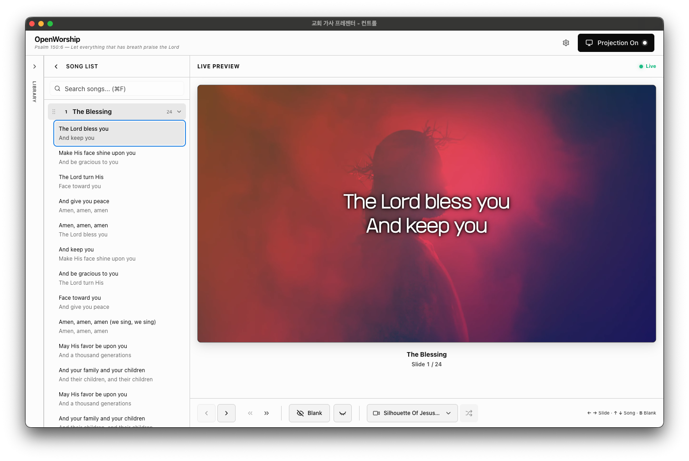

<p align="center">
  
</p>

<h1 align="center">OpenWorship</h1>

<p align="center">
  <strong>교회를 위한 무료 오픈소스 예배 프레젠테이션 소프트웨어</strong>
</p>

<p align="center">
  <a href="https://github.com/jaycho1214/openworship/releases/"></a>
  <a href="LICENSE"></a>
  
</p>

<p align="center">
  <a href="./README.md">English</a>
</p>

<br>

<p align="center">
  
</p>

<br>

<h2 align="center">
  <a href="https://github.com/jaycho1214/openworship/releases/">
    macOS, Windows, Linux 다운로드
  </a>
</h2>

---

## 주요 기능

<table>
<tr>
<td width="50%">

**듀얼 윈도우 시스템**

노트북에서 조작하면서 프로젝터에 송출합니다. 실시간 미리보기로 성도들이 보는 화면을 정확히 확인하세요.

</td>
<td width="50%">

**스마트 라이브러리**

영구적인 찬양 컬렉션을 구축하세요. 검색하고, 정리하고, 세션에 드래그하여 즉시 추가하세요.

</td>
</tr>
<tr>
<td width="50%">

**OCR 가져오기**

AI를 사용하여 이미지에서 가사를 자동 추출합니다. 더 이상 악보를 보고 타이핑할 필요가 없습니다.

</td>
<td width="50%">

**비디오 배경**

아름다운 모션 배경이 기본 제공됩니다. 직접 비디오를 추가하여 전문적인 예배 분위기를 연출하세요.

</td>
</tr>
<tr>
<td width="50%">

**커스텀 타이포그래피**

원하는 폰트를 가져오세요. 크기, 굵기, 그림자, 위치를 세밀하게 조절하여 교회 스타일에 맞추세요.

</td>
<td width="50%">

**키보드 단축키**

방향키로 이동, B키로 검은 화면, 마우스 없이 모든 것을 조작하세요.

</td>
</tr>
</table>

<br>

---

<br>

## 빠른 시작

```
1. 세션 만들기        →  예배용 셋리스트
2. 곡 추가하기        →  라이브러리, 직접 입력, OCR 가져오기
3. 송출 화면 열기     →  프로젝터/스크린에 표시
4. 방향키 사용        →  슬라이드 이동
```

<br>

---

<br>

## 설치

최신 버전 다운로드:

| 플랫폼      | 파일        |
| ----------- | ----------- |
| **macOS**   | `.dmg`      |
| **Windows** | `.exe`      |
| **Linux**   | `.AppImage` |

<p>
  <a href="https://github.com/jaycho1214/openworship/releases/">
    
  </a>
</p>

또는 소스에서 빌드:

```bash
git clone https://github.com/jaycho1214/openworship.git
cd openworship
npm install
npm start
```

<br>

---

<br>

## 사용 가이드

### 세션

**세션**은 예배 셋리스트입니다. 각 예배마다 하나씩 만드세요.

| 동작           | 방법                        |
| -------------- | --------------------------- |
| 세션 만들기    | 헤더에서 **"새 세션"** 클릭 |
| 세션 전환      | 헤더의 드롭다운 사용        |
| 세션 이름 변경 | 세션 이름 우클릭            |
| 세션 삭제      | 우클릭 → 삭제               |

세션은 자동으로 저장됩니다.

<br>

### 곡 추가하기

**직접 입력**

1. **"+ 추가"** 클릭
2. 제목과 가사 입력
3. 저장

빈 줄로 새 슬라이드를 구분합니다:

```
첫 번째 절 첫째 줄
첫 번째 절 둘째 줄

두 번째 절 첫째 줄
두 번째 절 둘째 줄
```

**라이브러리에서**

- 라이브러리 사이드바 열기 (왼쪽 가장자리)
- 곡 검색
- 세션으로 드래그

**OCR 가져오기**

1. **"+ 추가"** → **"이미지 가져오기"** 클릭
2. 파일을 드래그하거나 클릭해서 선택
3. AI가 가사 추출
4. 검토, 편집, 저장

> 설정 → API에서 OpenAI API 키 필요

<br>

### 키보드 조작

| 키                    | 동작                 |
| --------------------- | -------------------- |
| `←` `→`               | 이전 / 다음 슬라이드 |
| `↑` `↓`               | 이전 / 다음 슬라이드 |
| `Page Up` `Page Down` | 이전 / 다음 곡       |
| `Home` `End`          | 첫 / 마지막 슬라이드 |
| `B`                   | 검은 화면            |
| `V`                   | 절 표시 토글         |
| `Esc`                 | 송출 닫기            |

<br>

### 커스터마이징

**폰트** — 설정 → 외관. `.ttf` `.otf` `.woff` `.woff2` 지원

**비디오 배경** — 설정 → 디스플레이. `.mp4` `.webm` `.mov` 지원

**텍스트 스타일링** — 폰트 크기, 굵기, 그림자, 위치, 줄 높이 조정

<br>

---

<br>

## 팁

<details>
<summary><strong>주일 준비하기</strong></summary>
<br>

1. 주중에 미리 세션 만들기
2. 예배 순서대로 곡 추가
3. 슬라이드 구분 확인
4. 실제 디스플레이에서 테스트
5. 예배 전에 준비 완료

</details>

<details>
<summary><strong>최적의 슬라이드</strong></summary>
<br>

- 슬라이드당 2-4줄
- 자연스러운 노래 구절에 맞추기
- 한 줄 슬라이드 피하기 (너무 빠름)
- 6줄 이상 피하기 (너무 빽빽함)

</details>

<details>
<summary><strong>다중 모니터 설정</strong></summary>
<br>

1. 프로젝터를 확장 디스플레이로 연결
2. 메인 모니터에서 OpenWorship 열기
3. "송출 열기" 클릭
4. 송출이 보조 디스플레이로 이동
5. 메인에서 조작, 프로젝터에 표시

</details>

<br>

---

<br>

## 개발

| 명령어            | 설명           |
| ----------------- | -------------- |
| `npm start`       | 개발 모드      |
| `npm run build`   | 프로덕션 빌드  |
| `npm run package` | 설치 파일 생성 |
| `npm run lint`    | 코드 검사      |

### 아키텍처

```
src/
├── main/              # Electron 메인 프로세스
├── renderer/          # React UI (컨트롤 + 송출 윈도우)
└── shared/            # 공용 타입
```

### 기술 스택

Electron 35 · React 19 · TypeScript 5.8 · Tailwind CSS 4 · shadcn/ui · better-sqlite3 · OpenAI API

<br>

---

<br>

## 기여하기

기여를 환영합니다! 포크하고, 기능 브랜치를 만들고, Pull Request를 제출해 주세요.

<br>

---

<br>

## 후원

OpenWorship은 무료 오픈소스입니다. 사역에 도움이 되셨다면, 지속적인 개발을 후원해 주세요.

<p>
  <a href="https://github.com/sponsors/jaycho1214">
    
  </a>
  &nbsp;
  <a href="https://buymeacoffee.com/jaycho1214">
    
  </a>
</p>

<br>

---

<br>

## 라이선스

MIT 라이선스 — 교회나 사역에서 자유롭게 사용하세요.

<br>

---

<br>

<p align="center">
  <em>"호흡이 있는 자마다 여호와를 찬양할지어다"</em><br>
  <strong>시편 150:6</strong>
</p>

<p align="center">
  <sub>전 세계 교회를 위해 믿음으로 만들었습니다</sub>
</p>
